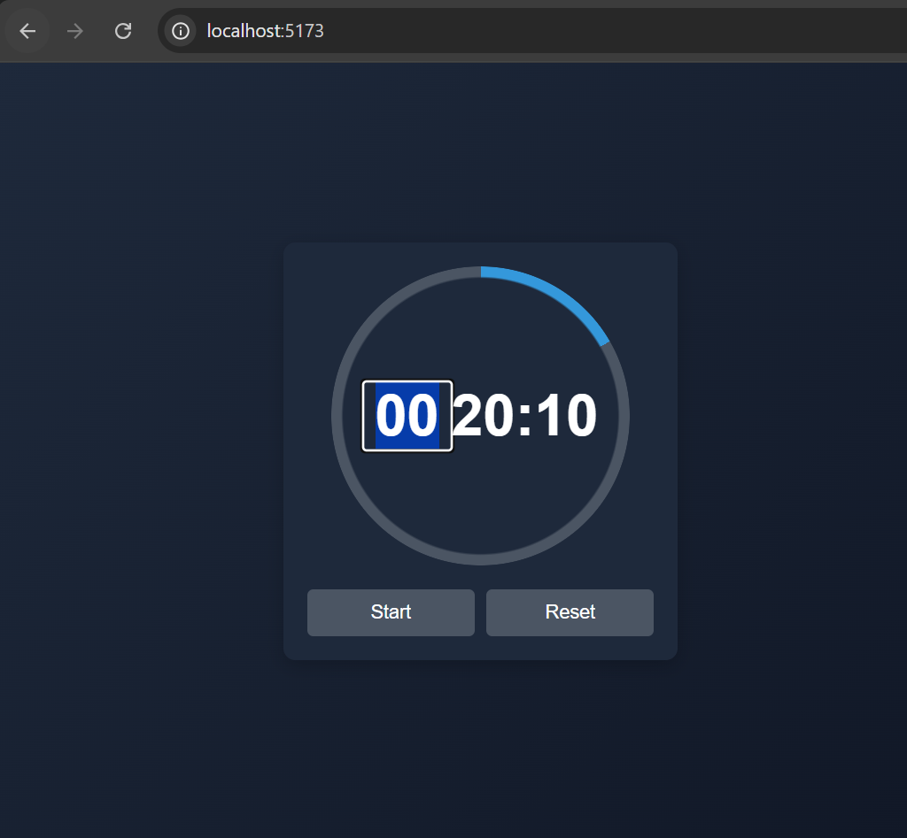

# Timer App in React



Most imp part that i learnt
Understanding editState.field
We need a way to track which part of the time (hours, minutes, or seconds) is currently being edited. For that, we'll use a state variable called editState.

Defining editState
We'll use useState to manage this:

const [editState, setEditState] = useState({ field: null, value: '' });

What does editState do?

field: Stores which part of the time is currently being edited. It can be 'hours', 'minutes', or 'seconds'. If null, it means no field is currently being edited.

value: Holds the temporary value of the field being edited (for example, if the user starts editing the hours, it will store the current hours as a string).

Example of how editState works

User Action editState.field editState.value
User clicks on "02" (hours) "hours" "02"
User types "03" "hours" "03"
User clicks outside (blur event) null ""

## Objective

Build a simple timer app with start, pause, reset, and editable time functionality.

---

## Steps:

### 1. **State Management**

- Use `useState` to track:
  - `time` (in seconds)
  - `isRunning` (timer status)
  - `editState` (for tracking the field being edited and its value)

### 2. **Countdown Logic**

- Implement a `useEffect` that updates the `time` every second when the timer is active.

### 3. **Editable Time**

- Allow users to click on hours, minutes, or seconds to edit that specific part of the time.

### 4. **Input Handling**

- Ensure inputs are limited to two digits (hours, minutes, seconds).

### 5. **Controls**

- Provide buttons for:
  - Starting/pausing the timer.
  - Resetting the timer.

---

## Core Functions:

### `handleEditField(field)`

**Signature:**

```js
const handleEditField = (field: string) => void
```

**Description:**
This function handles the edit operation of the hours, minutes, or seconds fields:

- If the field being edited is clicked again (i.e., `editState.field === field`), it saves the new value (with leading zeros if needed), calculates the new total time in seconds, and updates the `time` and `initialTime`.
- If the field is clicked for the first time, it pauses the timer and prepares the value for editing (removes leading zeros).

### 6. **Steps in `handleEditField`:**

1. **Check if field is being edited:**
   - If `editState.field === field`, this means the user has finished editing that field. We calculate and save the new value.
2. **Update time:**

   - We use the helper function `calculateTime` to calculate the new total time in seconds based on the edited hours, minutes, and seconds.

3. **Reset editing state:**

   - After saving the new value, we reset the editing state to `null`, indicating no field is being edited.

4. **Start editing the field:**
   - If the field was not previously being edited, pause the timer and display an input field for editing.

### **Example:**

```js
const newTime = {
  ...formatTime(time),
  [field]: editState.value.padStart(2, '0'), // Add leading zeros if necessary
};

const calculatedTime = calculateTime(newTime.hours, newTime.minutes, newTime.seconds);
```

### `calculateTime(hours, minutes, seconds)`

**Signature:**

```js
const calculateTime = (hours: string, minutes: string, seconds: string) => number;
```

**Description:**
This function calculates the total time in seconds based on the given `hours`, `minutes`, and `seconds`. If any of these values are invalid (i.e., `NaN`), it returns `0`.

### **Steps in `calculateTime`:**

1. Parse the hours, minutes, and seconds.
2. Convert hours to seconds (hours _ 3600), minutes to seconds (minutes _ 60), and add the seconds.
3. Check if the result is `NaN` (i.e., invalid input). If it is, return `0`; otherwise, return the calculated time.

### **Example:**

```js
const calculatedTime = parseInt(hours) * 3600 + parseInt(minutes) * 60 + parseInt(seconds);
```

## Auxiliary Functions:

### 1. `formatTime(time: number): { hours: string, minutes: string, seconds: string }`

**Purpose:**
Formats the given `time` (in seconds) into hours, minutes, and seconds. Each unit is always displayed as two digits (with leading zeros if necessary).

**Example:**
For `time = 3661`, the result would be `{ hours: '01', minutes: '01', seconds: '01' }`.

## To Do

### 1. Auto-move to Next Input Field on Two Digits

- Implement functionality to automatically move the focus to the next input field (hours, minutes, or seconds) when 2 digits are entered.

### 2. Reverse the Progress Ring Animation

- Modify the progress ring to fill counter-clockwise, reversing the direction of the stroke as the timer counts down.

---

### Reference UI:


