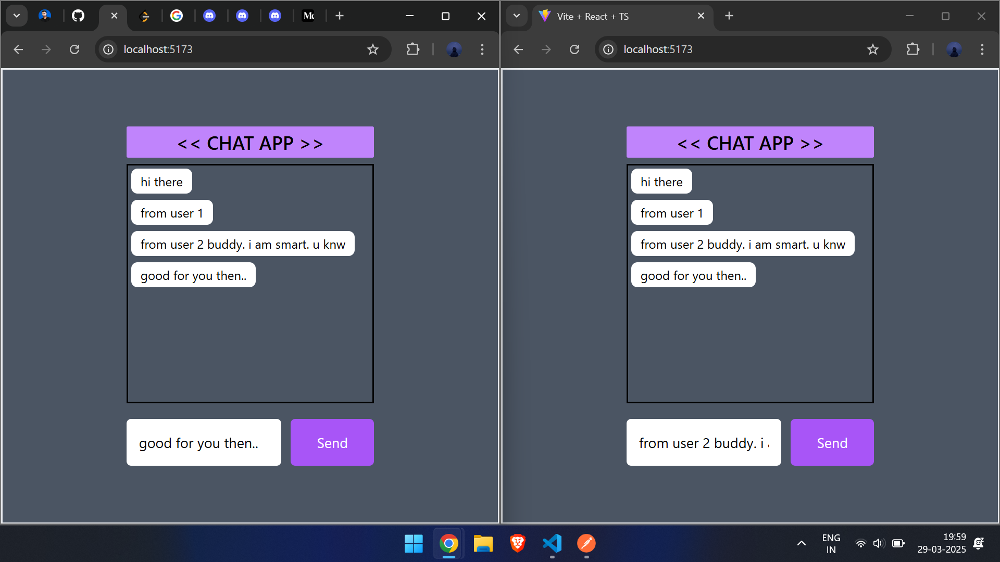

UI image 

next improvement will be, 
- adding usernames to messages (done)
- clearing the input boxes after sending msg (done)
- most recent msg is on focus and the messages are scolled down to the bottom-most/latest msg.



Improvements:

```
added username to the messages
```
A better way for doing it will be to make a login page with username and roomId.
(this is a little complicated since, the username can be changed and changing of room is not flexible. i have fixed it to red in backend.)


```
Input message box is cleared on sending a message.
```
used ts-ignore, was getting an error elsewise. idk why. but this worked.


